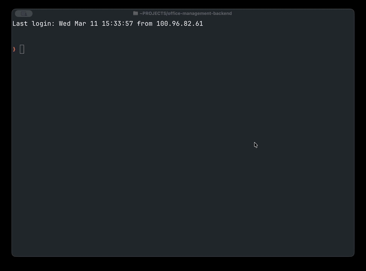

# 🇵🇱 KSEF CLI - Narzędzie CLI do obsługi Krajowego Systemu e-Faktur (KSeF) - dla ludzi i agentów AI.



Od 2026 roku każda polska faktura B2B musi przejść przez KSeF: zostać zaszyfrowana, przesłana przez sesyjne API i odebrana z numerem referencyjnym. Brzmi skomplikowanie, bo jest skomplikowane. `ksef-cli` chowa całą tę złożoność za prostymi komendami.

Podajesz XML - albo nawet skan PDF — a narzędzie zajmuje się resztą: uwierzytelnianiem RSA-OAEP, szyfrowaniem sesji AES-256-CBC, budowaniem FA(3) XML, wysyłką i pollingiem statusu. Jeśli PDF jest nieczytelny dla parsera, wchodzi Claude AI i wyciąga pola faktury multimodalnie.

Projekt jest też w pełni przystosowany do użycia przez **agentów AI**: każda kluczowa komenda obsługuje flagę `--json` z czystym JSON-em na stdout i ustrukturyzowanymi błędami na stderr. Dołączony [skill dla Claude Code](skills/ksef-cli/SKILL.md) pozwala agentowi natychmiast nauczyć się całego API narzędzia — bez dokumentacji, bez zgadywania.

---

## Instalacja

```bash
git clone https://github.com/ArturSkowronski/ksef-cli
cd ksef-cli
pip install -e ".[dev]"
```

Wymagany **Python 3.11+**.

Dla ekstrakcji wspomaganej AI, ustaw klucz Anthropic:

```bash
export ANTHROPIC_API_KEY=sk-ant-...
```

---

## Pierwsze kroki

Zapisz dane uwierzytelniające raz:

```bash
ksef config set --nip 1234567890 --token <TWÓJ_TOKEN_KSEF>
```

Zaloguj się (przeprowadza pełny flow challenge/response KSeF i zapisuje token sesji):

```bash
ksef auth login
```

Gotowe. Wyślij pierwszą fakturę:

```bash
ksef invoice send faktura.xml
```

To wszystko. `ksef-cli` otwiera zaszyfrowaną sesję, przesyła fakturę, zamyka sesję i czeka na potwierdzenie z KSeF. Dostajesz numer referencyjny KSeF gdy wszystko się zakończy.

---

## Uwierzytelnianie

KSeF używa wieloetapowego flow: challenge → zaszyfrowany token RSA → token dostępu + token odświeżania. `ksef-cli` obsługuje to transparentnie.

```bash
ksef auth login             # pełny flow, zapisuje sesję
ksef auth status            # pokaż wygaśnięcie sesji i tokeny
ksef auth refresh           # odśwież token dostępu
ksef auth logout            # wyczyść lokalne tokeny sesji
```

Sesje wygasają po około godzinie. Token odświeżania jest ważny 24 godziny. Użyj `ksef auth refresh` żeby przedłużyć sesję bez ponownego podawania danych.

---

## Praca z fakturami

### Z PDF lub zdjęcia do KSeF jedną komendą

```bash
ksef invoice send faktura.pdf
```

Narzędzie wyciąga pola faktury z PDF, buduje XML zgodny z FA(3) i wysyła go. Jeśli parser heurystyczny nie jest pewny (poniżej 50%), przełącza się na analizę multimodalną Claude AI. Przy niskim poziomie pewności zobaczysz ostrzeżenie — sprawdź wygenerowany XML przed wysłaniem.

### Wyślij XML bezpośrednio

```bash
ksef invoice send faktura.xml             # wyślij i czekaj na przetworzenie
ksef invoice send faktura.xml --no-wait   # wyślij bez czekania
```

### Podgląd przed wysłaniem

Konwertuj do XML bez wysyłania:

```bash
ksef invoice generate faktura.pdf --out faktura.xml
ksef invoice generate faktura.pdf          # wypisz na stdout
```

### Śledzenie i pobieranie

```bash
ksef invoice status <numer-referencyjny>                      # sprawdź status
ksef invoice get <numer-ksef> --out faktura.xml               # pobierz XML
ksef invoice get <numer-ksef> --pdf --out faktura.pdf         # wyrenderuj jako PDF
```

### Lista faktur

```bash
ksef invoice list                                              # bieżący miesiąc
ksef invoice list --date-from 2024-01-01 --date-to 2024-01-31
ksef invoice list --received                                   # faktury do Ciebie
ksef invoice list --seller-nip 9876543210                      # filtruj po sprzedawcy
```

---

## Dla agentów AI i automatyzacji

Każda kluczowa komenda obsługuje flagę `--json`. Żadnego Rich markup, żadnych interaktywnych promptów — tylko czysty JSON na stdout i `{"error": "..."}` na stderr z niezerowym exit code przy błędzie.

```bash
# Sprawdź sesję przed jakąkolwiek operacją
ksef auth status --json
# → {"nip": "1234567890", "environment": "PRD", "sessionActive": true, "expiresIn": 3542, "expiry": "..."}

# Lista faktur
ksef invoice list --json
# → {"invoices": [{"ksefNumber": "...", "invoiceNumber": "...", "buyer": "Acme Sp. z o.o.", "netAmount": "1000.00", ...}]}

# Wyślij i odbierz numer KSeF
ksef invoice send faktura.xml --json
# → {"invoiceRef": "...", "ksefNumber": "KSeF/123/2024", "processingCode": 200}

# Wysyłka nieblokująca
ksef invoice send faktura.xml --no-wait --json
# → {"invoiceRef": "...", "ksefNumber": null, "processingCode": null}
```

### Skill dla Claude Code

W katalogu [`skills/ksef-cli/`](skills/ksef-cli/) znajduje się skill dla agentów Claude Code. Po załadowaniu agent wie jak sprawdzić sesję, wywołać każdą komendę, sparsować odpowiedź JSON i obsłużyć błędy — bez żadnego zgadywania.

Żeby udostępnić skill lokalnie:

```bash
ln -s $(pwd)/skills/ksef-cli ~/.claude/skills/ksef-cli
```

---

## Konfiguracja

```bash
ksef config set --nip 1234567890 --token <TOKEN>
ksef config set --environment TEST    # PRD (domyślnie) | TEST | DEMO
ksef config show                      # tokeny są maskowane
```

Konfiguracja przechowywana w `~/.ksef/config.toml` z uprawnieniami 600. Dane uwierzytelniające nigdy nie pojawiają się w logach ani w outputcie.

---

## Jak działa flow sesji KSeF

KSeF v2 wymaga przesyłania faktur wewnątrz zaszyfrowanej sesji:

1. Pobierz certyfikat klucza publicznego KSeF
2. Wygeneruj świeży klucz AES-256 + wektor inicjalizacyjny
3. Zaszyfruj klucz AES algorytmem RSA-OAEP kluczem publicznym KSeF
4. Otwórz sesję (`POST /sessions/online`) z zaszyfrowanym kluczem
5. Zaszyfruj XML faktury algorytmem AES-256-CBC
6. Prześlij zaszyfrowaną fakturę w ramach sesji
7. Zamknij sesję
8. Czekaj na status przetworzenia (kod 200 = zaakceptowano)

`ksef-cli` przeprowadza cały ten flow automatycznie. Ty dostarczasz tylko XML (albo PDF).

---

## Rozwój

```bash
pip install -e ".[dev]"
pytest tests/ -v          # 55 testów
```

```
ksef/
├── main.py         # punkt wejścia CLI (Typer)
├── config.py       # konfiguracja (~/.ksef/config.toml)
├── client.py       # klient HTTP KSeF API (httpx)
├── auth.py         # komendy auth + szyfrowanie RSA-OAEP
├── invoice.py      # komendy faktur
├── crypto.py       # pomocniki AES-256-CBC + RSA-OAEP
├── extractor.py    # PDF/obraz → InvoiceData (pdfplumber + Claude)
├── xml_builder.py  # InvoiceData → XML FA(3)
├── models.py       # modele Pydantic
├── pdf_renderer.py # XML → PDF
└── tui.py          # interaktywny dashboard TUI

skills/ksef-cli/SKILL.md   # skill dla agentów Claude Code
```

---

## Licencja

MIT
